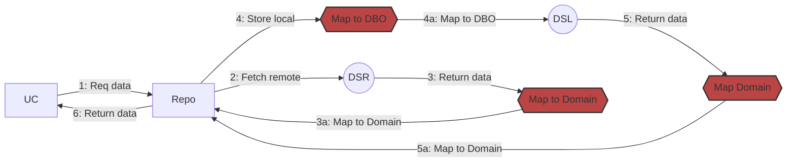

[](https://coveralls.io/github/m2f-kt/Archer?branch=main)
[](https://opensource.org/licenses/Apache-2.0)
[](https://central.sonatype.com/artifact/com.m2f-kt/archer-core)

## Archer

Archer is a lightweight framework for FCA (Functional Clean Architecture). It’s based on Arrow as a foundation and
provides all the necessary elements.

## Installation

```kotlin
dependencies {
    implementation("com.m2f-kt:archer-core:{version}")
}
```

## Clean Architecture in a nutshell

Normally when we talk about clean architecture we can state its benefits:

- Abstraction
- Reusability
- Scalability

But it comes with serious tradeoffs:

- Boilerplate
- Maintainability



### Legend

```
DSL -> DataSource Local
DSR -> DataSource Remote
UC  -> UseCase
```

To implement this diagram we would need normally an interface and implementation for each of the actors in the
diagram, this is:

- Usecase interface + Implementation (Optional)
- Repository interface + Implementation
- N * (DataSources + Implementation) where N is the number of different datasources the repository would orchestrate. (
  on average 2)
- X + Y Mappers Where X is the number of models different than the domain and Y is the number of data sources that
  expects and input model (database for example)

If we follow the previous example diagram we may need:

- 2 Usecase elements
- 2 Repository Elements
- 4 DataSource Elements (network and local)
- 3 Mappers (network -> domain), (local -> domain), (domain -> local)

## What does Archer provide?

This structure can be tedious to implement and the more use cases you need, the harder to maintain it comes.
Archer provides contractual data sources and Repositories for you to avoid the need to create all the boilerplate (
except the mapping, sorry, mappings are needed :D).

With archer that same structure could be implemented the following way:

```kotlin
// This DSL creates a GetDataSource, a computation that accepts an Int and returns a String
val remoteDataSource = getDataSource<Int, String> { param: Int -> “${ param }” }

// This is a default storage but devs can implement their own one.
// A Store dataSource has 2 tipe of queries, Get<Int> and Put<Int, String>, and the developer
// can implement both in order to provide a storage mechanism
val store: StoreDataSource<Int, String> = InMemoryDataSource()

val repositoryStrategy = remoteDataSource cacheWith store expiresIn 5.minutes

// ice stands for Idle | Content | Error
val resultIce = ice {
    repository.get(StoreSync, 0)
}

// Arrow's Either
val resultEither = either {
    repository.get(StoreSync, 0)
}

val resultNullable = nullable {
    repository.get(StoreSync, 0)
}

result shouldBe Ice.Content("0")
resultEither shouldBe Right("0")
resultNullable shouldBe "0"
```
