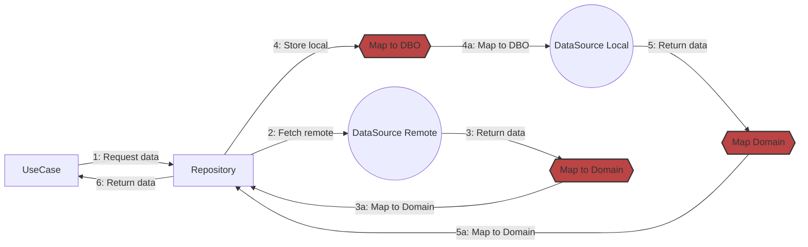

# Clean Architecture with Archer

Understanding how Archer simplifies Clean Architecture implementation.

## Traditional Clean Architecture Flow

In a typical Clean Architecture implementation, data flows through multiple layers with extensive boilerplate:



### Legend
- **UC** - UseCase
- **DSL** - DataSource Local
- **DSR** - DataSource Remote

### Traditional Implementation Requirements

For the above diagram, you typically need:

1. **UseCase Layer**
   - Interface: `GetDataUseCase`
   - Implementation: `GetDataUseCaseImpl`

2. **Repository Layer**
   - Interface: `DataRepository`
   - Implementation: `DataRepositoryImpl`

3. **DataSource Layer** (×2 for network and local)
   - Interface: `RemoteDataSource`
   - Implementation: `RemoteDataSourceImpl`
   - Interface: `LocalDataSource`
   - Implementation: `LocalDataSourceImpl`

4. **Mapping Layer**
   - Network model → Domain model mapper
   - Domain model → Local model mapper
   - Local model → Domain model mapper

**Total: ~11 files** for a single data flow!

## Archer's Approach

Archer reduces this to just the essential parts:

```kotlin
// 1. Define data sources (no interfaces needed!)
val remoteDataSource = getDataSource<UserId, User> { userId ->
    api.fetchUser(userId).toDomain()  // You still need mapping
}

val localDataSource: StoreDataSource<UserId, User> =
    DatabaseDataSource()  // Implement get/put operations

// 2. Create repository strategy
val userRepository = remoteDataSource cacheWith localDataSource expiresIn 5.minutes

// 3. Use it directly
val user = either {
    userRepository.get(StoreSync, userId)
}
```

### What Archer Provides

1. **Contractual DataSources** - Predefined contracts that eliminate interface boilerplate
2. **Composable Repositories** - Build complex data strategies with simple DSL
3. **Multiple Result Types** - Ice, Either, or Nullable based on your needs
4. **Built-in Patterns** - Caching, validation, error handling

### What You Still Implement

- **Mapping Logic** - Data transformation between layers (this is essential!)
- **Business Logic** - Your actual use cases
- **Data Source Implementation** - How you fetch/store data

## Benefits

### Abstraction
Clean separation between data fetching, caching, and business logic.

### Reusability
DataSources and repositories are highly composable and reusable.

### Scalability
Easy to add new data sources or change caching strategies.

### Less Boilerplate
No need to create interfaces for every layer.

## Next Steps

- [DataSources](/docs/usage/datasources) - Learn about different types of data sources
- [Repositories](/docs/usage/repositories) - Understand repository strategies
- [Result Types](/docs/usage/result-types) - Explore Ice, Either, and Nullable
